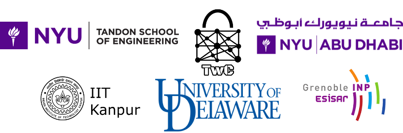

### The second challenge set has been released [here](challenges).

### The finalists are announced [here](finalists.md)

CSAW 2020 Embedded Security Challenge (ESC) [![License MIT][badge-license]](LICENSE)
===========================================

  

## Quick Links

* [Registration](https://github.com/TrustworthyComputing/csaw_esc_2020#registration)
* [Deadlines/Logistics](https://github.com/TrustworthyComputing/csaw_esc_2020/blob/master/logistics.md#competition-deadlines)
* [Challenge Description](https://github.com/TrustworthyComputing/csaw_esc_2020/blob/master/challenge_description.md#esc-2020-challenge-description)
* [Final Phase Description](https://github.com/TrustworthyComputing/csaw_esc_2020/blob/master/final_phase.md#final-phase)
* [Final Binaries](https://github.com/TrustworthyComputing/csaw_esc_2020/tree/master/challenges)
* [Final Deliverables](https://github.com/TrustworthyComputing/csaw_esc_2020/blob/master/deliverables-final-phase.md)

## Overview

The Embedded Security Challenge (ESC) returns in 2020 for the 13th time, and we are proud to announce another exciting and educational global competition! ESC is part of [CSAW](https://www.csaw.io/), which is founded by the department of Computer Science and Engineering at NYU Tandon School of Engineering, and is the most comprehensive student-run cyber security event in the world, featuring international competitions, workshops, and industry events.

ESC 2020 will be a **world-wide virtual event** held simultaneously in four regions: US-Canada, Europe, Middle East & North Africa, and India, with the finals taking place on 5-8 November 2020. The organizers for each region are:

-   **CSAW US-Canada**: NYU Tandon School of Engineering, Brooklyn, USA.
-   **CSAW Europe**: Grenoble Institute of Technology - ESISAR, Grenoble, France.
-   **CSAW MENA**: NYU Abu Dhabi, Abu Dhabi, UAE.
-   **CSAW India**: Indian Institute of Technology Kanpur, Kanpur, India.

The competition is organized in all regions under the supervision of Professor Nektarios Tsoutsos (University of Delaware), and the global challenge leads are Charles Gouert, Dimitris Mouris and Lars Folkerts, who are also the US-Canada region challenge leads.
In Europe, the competition is organized by Professor Vincent Beroulle.
In the MENA region, the competition is coordinated by Professor Michail Maniatakos with Dimitris Tychalas as the regional challenge lead. In India, ESC is supervised by Professor Sandeep Shukla, with Rohit Negi as the regional challenge lead.

## Challenge Summary
This year's ESC focuses on the security of Internet of Things (IoT), which are embedded devices with network connectivity. IoT are ubiquitous in modern smart infrastructure with an estimate of over 20 billion IoT devices connected today.
This challenge will task contestants with **hacking the firmware of a wifi access point running on a RISC-V IoT platform (shown above) using open-source reverse engineering tools**. The event comprises a qualification and a final phase where teams will be able to acquire and demonstrate their skills in a range of cybersecurity areas while solving a veritable gauntlet of interesting and fun problems.

**Motivational scenario:** Paper-Thin Security LLC is in the midst of installing a brand-new, custom RISC-V Wi-Fi access point to enforce network access control policies company-wide. Unfortunately, a malicious insider introduced backdoors that have rendered every department vulnerable! To cover their tracks, the spy made sure that only elite hackers would be able to reverse engineer and exploit these backdoors. Do you have what it takes to penetrate Paper-Thin Security’s infrastructure and gain top secret clearance? Can you reverse engineer Paper-Thin's WiFi AP?

Further details and specifics can be found on the [challenge description](challenge_description.md) page.

## Registration

Students of all university levels are invited to compete. Each team must have a **team leader** and up to 3 additional team members (a total of 4 participants per team). Each team leader is responsible for coordinating with other members of their team and will be the point of contact for the entire team. Each team must also have a university **faculty advisor**.

The team leaders need to register their team members and faculty advisor electronically at https://hotcrp.engineering.nyu.edu/, using their team name as the 'Submission Title'. ESC uses a HotCRP-based registration and submission system for both the qualification and final rounds, and teams **must register before finalizing their report and computer file submissions** by the posted deadlines.

Each team is eligible to register for **only one region** based on university affiliation: Europe, India, MENA, or US-Canada, as defined below.
While team members do not need to attend the same university, all team members must be a part of the same region.

-   **US-Canada**: Hosting students from universities located within the United States or Canada.
-   **Europe:** Hosting students from universities located in the European Union, Switzerland, Norway, Armenia, United Kingdom.
-   **India:** Hosting students from universities located in India.
-   **MENA:** Hosting students from universities located in Algeria, Azerbaijan, Bahrain, Chad, Djibouti, Egypt, Eritrea, Georgia, Iran, Iraq, Israel, Jordan, Kuwait, Lebanon, Libya, Mauritania, Morocco, Oman, Pakistan, Palestine, Qatar, Saudi Arabia, South Sudan, Sudan, Syria, Tunisia, Turkey, United Arab Emirates, or Yemen.

To be able to qualify to the final round, each team must register for the correct region based on the university affiliations of its members.

After registration closes, making changes to the existing members of a team (e.g., replacing a team member) or adding new team members, requires explicit permission from the organizers. This is also necessary for teams replacing team members or adding new team members during the final round of the competition.

For more registration information, policies, deadlines, deliverable details, and for information for contacting CSAW organizers, visit the [logistics](logistics.md) page.

**Teams are encouraged to start investigating the challenge as early as possible.**

*It is also recommended to periodically visit this repository on GitHub, as the details may be updated*.

---

    

[badge-license]: https://img.shields.io/badge/license-MIT-green.svg
